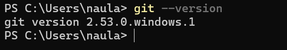
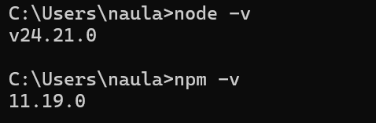
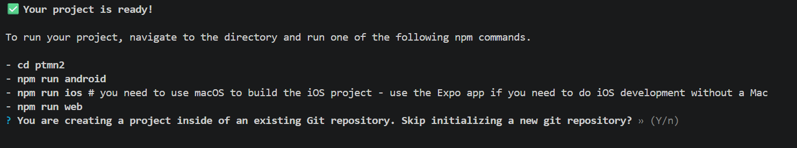

# Praktikum Menyiapkan Lingkungan Pengembangan dan Memulai Pemrograman Mobile (React Native) #

## Tujuan Pembelajaran ##
Mahasiswa mampu:
1. Menyiapkan lingkungan pengembangan dan memulai pemrograman mobile ((React Native))
2. Membuat aplikasi mobile dengan React Native
3. Menyelesaikan Tugas CV sederhana dengan React Native

## Materi dan Laporan Praktikum ##
1. Menyiapkan lingkungan pengembangan dan memulai pemrograman mobile (React Native)
    - Memastikan instalasi Git bash
        -  Cek Instalasi Git bash (git --version)
        - Bukti verifikasi
        

    - Memastikan Node.js dan NPM
        - Download dan Install Node.js di https://nodejs.org/en/download/
        - Konfirmasi Node.js dan NPM (node -v, npm -v)
        

2. Membuat aplikasi/project baru dengan React Native Framework Expo Go
    - Buka dan baca dokumentasi resmi link https://docs.expo.dev/
    - Buka dan baca dokumentasi resmi link https://reactnative.dev/decs/
    - Memulai Membuat project baru
    - Open terminal change directory ke Pertemuan-2
    - Masukan perintah (npx create-expo-app ptmn2 --template blank)
    - Bukti verifikasi
    

    - Running Project  
        - Cd ke ptmn2
        - npx expo start
        - Install Expo di Android atau IOS
        - Bisa juga menggunakan web emulator di Laptop / PC
        - Setelah running diberhentikan (ctrl + C)
        - Install (npx expo i react -dom react-native-web)
        - npx expo start --web
        - Konfirmasi keberhasilan
        

3. Tugas Praktikum
    - Membuat aplikasi CV sederhana dengan React Native
    - Nama lengkap
    - NIM
    - Asal Sekolah  
    - Cita-cita
    - Rencana menggapai cita-cita 
    - Konfirmasi keberhasilan 

                                                                                 